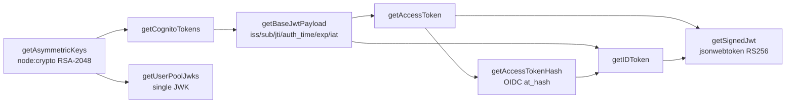

# aws-mock-data — Repository Review & Proposal Plan

> Reviewed at commit `dc708fb` (v1.3.3) on 2026-07-19.
> Scope: full repo — architecture, API design, packaging, CI/CD, release engineering, security posture, tests, docs, governance.
> This document contains **findings and proposals only**. Nothing beyond this file was changed.

---

## 1. Executive summary

The library is in good health for its size: clean modular TypeScript, strict compiler settings, 21/21 tests passing with 100% line/function coverage, a tight 11.9 kB publish tarball, fully automated releases via semantic-release, and — notably ahead of most small packages — npm **Trusted Publishing with provenance already enabled**. Production dependencies audit clean (0 vulnerabilities).

The problems are concentrated in three places:

1. **Packaging debt that leaks to consumers.** Every `npm install aws-mock-data` also installs a pinned Linux Rollup *native binary* (`@rollup/rollup-linux-x64-gnu`) because a build-time workaround lives in `optionalDependencies`, which ships with the published manifest. Worse, Dependabot bumps to it are titled `fix(deps):`, so semantic-release has published three consumer-visible patch releases (1.3.1 → 1.3.3) that contain **zero library changes**. Open PR #151 will do it a fourth time.
2. **The Bun migration is half-finished.** The runtime/tooling moved to Bun, but CLAUDE.md, CONTRIBUTING.md, the bug-report template, and a stale `.yarnrc.yml` still describe Yarn/Jest; `tsc --noEmit` produces 103 errors in tests (no test-runner types); and the package is now **only ever tested under Bun**, even though what ships is a Node library exercised via `jsonwebtoken`.
3. **Docs/API drift.** The README Quick Start does not compile (`types.User` is not exported; `keyLength` doesn't exist — the option is `modulusLength`), and `getUserPoolJwks` returns a single JWK — not a JWKS — while reading public parameters from the *private* key export.

### Health snapshot (verified 2026-07-19)

| Check | Result |
|---|---|
| `bun install` | ✅ 463 packages, 3.3 s |
| `bun run lint` / `pretty:check` | ✅ clean (but scoped to `src/` only) |
| `bun run build` (tsup) | ✅ CJS + ESM + d.ts/d.mts |
| `bun test --coverage` | ✅ 21/21, 100% funcs & lines |
| `tsc --noEmit` (src + tests) | ❌ 103 errors (missing test-runner types) |
| `bun audit` | ⚠️ 59 vulns — **all in dev tree** (semantic-release/tsup chains) |
| `npm audit --omit=dev` | ✅ 0 vulnerabilities |
| `attw --pack` (types resolution) | ✅ no errors — but Node ESM consumers silently receive the **CJS** build |
| Publish tarball | ✅ 9 files, 11.9 kB unpacked 61.5 kB |
| Repo state | ~50 commits since 2024-11, single maintainer, 0 open issues, 5 open Dependabot PRs |

### Top 10 priorities

| # | Proposal | Domain | Priority |
|---|---|---|---|
| 1 | [PKG-1](#pkg-1) Stop shipping `@rollup/rollup-linux-x64-gnu` to consumers | Packaging | P0 |
| 2 | [REL-1](#rel-1) Stop phantom releases from Dependabot `fix(deps):` CI bumps | Release | P0 |
| 3 | [API-1](#api-1) Export the real public type surface (`User`, `AsymmetricKeys`, …) | API | P0 |
| 4 | [DOC-1](#doc-1) Fix README examples that don't compile | Docs | P0 |
| 5 | [CI-1](#ci-1) Test under Node (matrix) + smoke-test the built artifact | CI | P1 |
| 6 | [PKG-2](#pkg-2) Add `exports` map, `engines`, `sideEffects`; fix `repository.type` | Packaging | P1 |
| 7 | [SEC-1](#sec-1)–[SEC-4](#sec-4) Supply-chain hardening (SHA pins, frozen lockfile, least-priv, CodeQL/Scorecard) | Security | P1 |
| 8 | [DX-1](#dx-1) Finish the Bun migration (docs, `@types/bun`, `typecheck` script, delete `.yarnrc.yml`) | Chores | P1 |
| 9 | [API-2](#api-2) Make `getUserPoolJwks` return a real JWKS; custom-claims support ([FEAT-1](#feat-1)) | API | P1–P2 |
| 10 | [TEST-1](#test-1) Integration test against `aws-jwt-verify` (the AWS-official verifier) | Testing | P2 |

---

## 2. Current state review

### 2.1 What the library is

A test-support library that fabricates **cryptographically valid** AWS Cognito artifacts: RS256-signed ID/access tokens with realistic claim sets (including OIDC-correct `at_hash`, verified against the spec during this review), and the matching JWK so consumers can stand up fake JWKS endpoints. Public API surface (from the built `dist/index.d.ts`):

```
awsServices.cognito.getCognitoTokens(props) → { id_token, access_token }
awsServices.userPool.getUserPoolJwks(props) → jwk | null
utils.getAsymmetricKeys(props?)             → { keyId, pem, der, jwk }
utils.getUUID()                             → uuid
types                                       → CognitoTokens, GetCognitoTokensProps (only!)
```



Internal layering is clean: `awsServices` (entry) → `helpers` (per-service assembly) → `utils` (crypto/JWT primitives) → `constants`/`types`. Tests mirror `src/` 1:1.

### 2.2 What's working well (worth preserving)

- **Release automation is genuinely modern**: semantic-release + conventional commits + Trusted Publishing (OIDC, no long-lived `NPM_TOKEN` secret) + `provenance: true`. Many far larger packages haven't gotten here.
- **Tight publish artifact**: `files: ["dist/"]`, 9 files, source maps included, no test/config leakage.
- **Strict TypeScript** (`strict` plus `noUnusedLocals`, `noImplicitReturns`, etc.).
- **100% test coverage** of statements/functions with meaningful assertions (tokens are actually `jwt.verify`-ed against the generated public key, wrong-key rejection is tested).
- **Dependabot** with grouped updates and reviewer assignment; **text-based `bun.lock`** committed.
- **Minimal runtime dependency surface**: one production dep (`jsonwebtoken`), prod tree audits clean.
- **Correct OIDC `at_hash`** implementation (left-most 128 bits of SHA-256, base64url).
- CI baseline permissions are already restricted (`contents: read` at workflow level).

### 2.3 Where the risk actually lives

Not in the crypto or the token logic — those are sound for a test library. The risk is operational: what ships in the manifest, what triggers a release, what CI actually proves (currently: "works under Bun 1.x on Linux" — nothing about Node), and docs that mislead contributors and users.

---

## 3. Findings register

Severity: **H**igh / **M**edium / **L**ow / **I**nfo. Every finding is backed by evidence gathered during this review.

| ID | Sev | Area | Finding | Evidence |
|---|---|---|---|---|
| F-01 | H | Packaging | `optionalDependencies: @rollup/rollup-linux-x64-gnu@4.61.1` ships in the published manifest → installed into consumers' `node_modules` (Linux x64). It is a build-time workaround for tsup/Rollup, not a runtime dep. | `package.json:42-44`; confirmed present in the npm registry manifest for 1.3.3 |
| F-02 | H | Release | Releases 1.3.1, 1.3.2, 1.3.3 are **only** bumps of that Rollup binary, published to npm as `fix:` patches. Dependabot groups it under `production-dependencies` with `prefix: "fix"`. Open PR #151 repeats this. | `git log`; `.github/dependabot.yaml:12-19`; CHANGELOG.md |
| F-03 | H | Release | Dependabot GitHub-Actions bumps now arrive titled `fix(deps):` (open PRs #145, #148, #152). semantic-release analyzes the message only — merging any of them publishes a phantom npm patch release for a CI-only change. | Open PR titles vs. merged `chore(deps):` history |
| F-04 | H | Docs/API | README Quick Start doesn't compile: `types.User` is not exported (`src/types/index.ts` exports only `CognitoTokens`, `GetCognitoTokensProps`); `getAsymmetricKeys` option documented as `keyLength` but is `modulusLength`. | `README.md:47,105`; `src/types/index.ts`; `dist/index.d.ts` |
| F-05 | M | API | `getUserPoolJwks` returns a single JWK, not a JWKS (`{ keys: [...] }`) — README shows users hand-wrapping it; reads `kty`/`e`/`n` from `jwk.privateKey` instead of `jwk.publicKey` (no key material leaks — only public params are copied — but it's fragile and reads wrong); returns `null` instead of throwing. | `src/awsServices/cognito/userPool.ts:7-26`; `README.md:129-139` |
| F-06 | M | CI | The package is a Node library but is never tested on Node: tests run exclusively under `bun test`; the built `dist/` is never imported by anything in CI. `jsonwebtoken` + `node:crypto` behavior under Node LTS is unverified per release. | `.github/workflows/ci.yaml:36`; `package.json:32` |
| F-07 | M | CI | Release workflow's `workflow_dispatch` trigger is dead: `if: github.event.workflow_run.conclusion == 'success'` is always false on manual dispatch, so the job always skips. | `.github/workflows/release.yaml:4,19` |
| F-08 | M | DX | `tsc --noEmit` over the repo yields **103 errors** — every test file fails on `describe`/`it`/`expect` (no `@types/bun`); there is no `typecheck` script and CI never type-checks tests (tsup's DTS step type-checks `src` only). | verified locally; `package.json` devDeps |
| F-09 | M | Packaging | No `exports` map: Node ESM consumers resolve via `main` to the **CJS** build; `dist/index.mjs`/`index.d.mts` are shipped but unreachable in Node (only bundlers honor `module`). No `engines`, no `sideEffects`. `repository.type` is `"github"` (npm expects `"git"`). | `package.json:5-17`; `attw --pack` result |
| F-10 | M | Docs | Stale Yarn/Jest era artifacts: CLAUDE.md (Yarn v4.2.2, Jest, `yarn *` commands), CONTRIBUTING.md (Yarn everywhere), bug template asks for "Yarn version", `.yarnrc.yml` points at a non-existent `.yarn/releases/yarn-4.2.2.cjs`. | respective files |
| F-11 | L | Security | CI workflow grants `actions: write` — nothing in the job needs it (concurrency cancellation requires no permission). | `.github/workflows/ci.yaml:3-5` |
| F-12 | L | Security | Actions pinned by tag, not commit SHA; `bun install` in CI and Release without `--frozen-lockfile` → lockfile drift possible at build/publish time. | both workflows |
| F-13 | L | Quality | Lint/format cover `src/` only: `eslint src` + ESLint config ignores `tests/` and `tsup.config.ts`; `prettier --check src` misses tests, configs, YAML, MD. | `package.json:27-29`; `eslint.config.mjs:6` |
| F-14 | L | Deps | 59 vulnerabilities (1 critical, 26 high) — **all in the dev tree** (semantic-release / tsup / eslint chains); prod tree is clean. Dependabot PR #150 (7 dev updates) is open. | `bun audit`; `npm audit --omit=dev` |
| F-15 | L | CI | `cancel-in-progress: true` applies to `main` pushes too: a rapid second merge cancels the first commit's CI → its Release (gated on `workflow_run` success) silently never happens. | `.github/workflows/ci.yaml:16-18` |
| F-16 | L | CI | Codecov upload uses a secret token with `fail_ci_if_error: true` → external fork PRs (no secret access) can fail CI on the upload step. | `.github/workflows/ci.yaml:37-42` |
| F-17 | I | Realism | Access token lacks Cognito's `version` claim; `iat` always equals `auth_time` (real Cognito: `iat` updates on refresh, `auth_time` doesn't); no way to inject custom claims (`custom:*`) — the single most common Cognito test need. | `src/helpers/cognito/*.ts`; `src/constants/awsServices/cognito.ts` |
| F-18 | I | Governance | No SECURITY.md, PR template, CODEOWNERS, CODE_OF_CONDUCT, `.editorconfig`, `.nvmrc`. Issue templates are legacy Markdown (not issue forms). | repo root; `.github/` |
| F-19 | I | Code | Filename typo `src/types/helpers/cognito/getAcessToken.ts`; unnecessary `as` cast in `getAsymmetricKeys.ts:13`; `@ts-expect-error` in `sortObjectKeys.ts:33`; internal `getSignedJwt` silently signs with a **random UUID as HMAC secret** when no secret is passed (unrecoverable signature; would throw if paired with RS256 options); bare `"crypto"` imports instead of `node:crypto`. | respective files |
| F-20 | I | API | `AsymmetricKeys.jwk` is typed as the all-optional lib `JsonWebKey`, which is what forces the `null`-return path in `getUserPoolJwks`. A precise `RsaJwk` type would delete that failure mode at compile time. | `src/types/utils/getAsymmetricKeys.ts:11-14` |

---

## 4. Proposals

Format per item: **Problem → Proposal → Acceptance criteria**. Priority P0 (user-facing correctness, do first) → P3 (exploratory). Effort S (<½ day), M (≤2 days), L (multi-day).

### A. Packaging & distribution

<a id="pkg-1"></a>
**PKG-1 · Evict the Rollup native binary from the published manifest — P0 · S** *(F-01, F-02)*
- **Problem:** A build-only native binary is delivered to every consumer and generates phantom releases.
- **Proposal:** Move `@rollup/rollup-linux-x64-gnu` to `devDependencies` (devDeps never ship). First try deleting it entirely — the original "cannot find module @rollup/rollup-…" npm/Bun optional-deps bug is fixed in current Bun; only re-add (as devDep) if CI reproduces the failure. Close/supersede PR #151 accordingly.
- **Acceptance:** Registry manifest for the next release contains no `optionalDependencies`; fresh `npm i aws-mock-data` on Linux x64 installs only `jsonwebtoken` + its tree; CI green.

<a id="pkg-2"></a>
**PKG-2 · Modern package manifest: `exports`, `engines`, `sideEffects`, metadata fixes — P1 · S** *(F-09)*
- **Proposal:**
  ```jsonc
  "exports": {
    ".": {
      "import": { "types": "./dist/index.d.mts", "default": "./dist/index.mjs" },
      "require": { "types": "./dist/index.d.ts", "default": "./dist/index.js" }
    },
    "./package.json": "./package.json"
  },
  "engines": { "node": ">=18" },   // node:crypto JWK export needs ≥15.9; 18 = oldest sensible LTS
  "sideEffects": false,             // enables tree-shaking of the namespace exports
  "repository": { "type": "git", "url": "git+https://github.com/ShellXploit/aws-mock-data.git" }
  ```
  Keep `main`/`module`/`types` for legacy tooling. Gate with `attw --pack` in CI (see CI-2).
- **Acceptance:** `attw --pack` shows ESM consumers resolving the ESM build; Node 18 ESM `import` smoke test loads `dist/index.mjs`.

**PKG-3 · Go zero-runtime-dependency — P2 · M**
- **Problem:** `jsonwebtoken` is the only runtime dep and drags ~14 transitive packages (jws, jwa, lodash.* micro-packages, ms, semver) into every consumer install — for what is, here, a fixed RS256 sign of a JSON payload.
- **Proposal (pick one):**
  - *(a)* Replace with `jose` — zero deps, ESM-native, actively maintained, also provides JWKS utilities you'll want for FEAT-2; or
  - *(b)* Hand-roll RS256 signing with `node:crypto` (`createSign("RSA-SHA256")` + base64url header/payload) — ~25 lines, no deps at all, entirely appropriate since the library only ever signs (never verifies) and only RS256.
  - Keep `jsonwebtoken` in devDeps as the independent verifier in tests either way (verifying with a different implementation than the one that signs is a stronger test).
- **Acceptance:** `npm ls --omit=dev` shows zero packages; existing tests (which verify via `jsonwebtoken`) still pass unchanged.

**PKG-4 · Production-use guard — P3 · S**
- **Problem:** The library mints *valid* signed credentials; accidentally bundling it into a production service is the worst-case misuse.
- **Proposal:** One-time `console.warn` from `getCognitoTokens`/`getAsymmetricKeys` when `process.env.NODE_ENV === "production"` (suppressible via `AWS_MOCK_DATA_SILENCE_PRODUCTION_WARNING`). Documented in README. Zero cost in tests, loud where it matters.
- **Acceptance:** Unit test asserts the warning fires exactly once under `NODE_ENV=production` and never otherwise.

### B. Release engineering

<a id="rel-1"></a>
**REL-1 · Make releases mean something again — P0 · S** *(F-02, F-03)*
- **Proposal:**
  1. In `dependabot.yaml`, give the `github-actions` ecosystem an explicit `commit-message: { prefix: "ci" }` (a no-release type) so Actions bumps can never publish.
  2. After PKG-1, the Rollup dep falls into the `development-dependencies` group (`chore` prefix) — phantom `fix:` releases from it end automatically.
  3. Add a release-rules guard in `release.config.js` documenting the intent: only `fix`/`feat`/breaking release.
- **Acceptance:** Merging open PRs #145/#148/#152 (rebased) produces no npm release; merging a real `fix:` still does.

**REL-2 · Repair or remove the dead manual release path — P1 · S** *(F-07)*
- **Proposal:** `if: github.event_name == 'workflow_dispatch' || github.event.workflow_run.conclusion == 'success'`. Manual dispatch is the emergency lever when the `workflow_run` chain hiccups (e.g. F-15) — it should work.
- **Acceptance:** A `workflow_dispatch` run on `main` executes semantic-release (and no-ops gracefully when there's nothing to release).

**REL-3 · Don't cancel `main` CI — P2 · S** *(F-15)*
- **Proposal:** `cancel-in-progress: ${{ github.event_name == 'pull_request' }}` in the CI concurrency block. PRs keep fast-cancel; `main` runs always complete, so the release trigger can't be starved.
- **Acceptance:** Two rapid merges to `main` both complete CI; both are evaluated for release.

**REL-4 · Decide on the `@semantic-release/git` back-commit — P3 · S**
- **Problem:** Committing CHANGELOG.md + package.json back to `main` (`chore(release): x.y.z [skip ci]`) conflicts with any future branch-protection ruleset and creates untested commits on `main`.
- **Proposal:** Either (a) drop `@semantic-release/changelog`/`git` and let GitHub Releases be the changelog (npm shows versions; the release notes live on the Releases tab), or (b) keep it and add a ruleset bypass for the workflow (SEC-5). Deliberate choice, documented in CONTRIBUTING.
- **Acceptance:** Ruleset (SEC-5) and release flow coexist without manual intervention.

### C. Security & supply-chain hardening

<a id="sec-1"></a>
**SEC-1 · Pin all GitHub Actions to commit SHAs — P1 · S** *(F-12)*
- **Proposal:** `actions/checkout@<sha> # v6`, `oven-sh/setup-bun@<sha> # v2.2.0`, `actions/setup-node@<sha> # v6.4.0`, `codecov/codecov-action@<sha> # v6`. Dependabot keeps bumping SHAs automatically (it understands the comment convention). This is the OSSF-recommended defense against tag-rewrite attacks — particularly relevant for a workflow holding `id-token: write` npm-publish rights.
- **Acceptance:** `zizmor` / Scorecard "Pinned-Dependencies" check passes for workflows.

<a id="sec-2"></a>
**SEC-2 · Deterministic installs in CI and Release — P1 · S** *(F-12)*
- **Proposal:** `bun install --frozen-lockfile` in both workflows. The artifact you publish should be built from exactly the committed `bun.lock` — today a poisoned or merely newer transitive version could slip into a release build unnoticed.
- **Acceptance:** CI fails when `package.json` and `bun.lock` disagree.

<a id="sec-3"></a>
**SEC-3 · Least-privilege workflow permissions — P1 · S** *(F-11)*
- **Proposal:** Drop `actions: write` from CI (nothing uses it). Keep Release permissions job-scoped as they are (they're correct for semantic-release). Add explicit `permissions: contents: read` to any future workflow as a default habit.
- **Acceptance:** CI runs green with `permissions: { contents: read }` only.

<a id="sec-4"></a>
**SEC-4 · Continuous security scanning — P1–P2 · M**
- **Proposal (each is a small independent workflow):**
  - `github/codeql-action` (JS/TS) on PR + weekly schedule — free for public repos.
  - `actions/dependency-review-action` on PRs — blocks introducing known-vulnerable or unwanted-license deps at review time.
  - `ossf/scorecard-action` weekly + README badge — externally-visible hardening score, and it will keep honest the items above (pinning, token perms, branch protection).
  - `zizmor` (workflow static analysis) as a lint step — catches template-injection and permission mistakes in the workflows themselves.
  - Optionally `osv-scanner` for the lockfile (complements `bun audit`, which is advisory-only today since 59 dev-tree vulns don't fail anything).
- **Acceptance:** All new workflows green on `main`; Scorecard ≥ 7 within a quarter.

**SEC-5 · Repo settings hardening (no code) — P1 · S**
- **Proposal:** Enable: branch ruleset on `main` (require CI, require linear history, block force-push; bypass for the release workflow per REL-4), secret scanning **with push protection**, private vulnerability reporting (pairs with SECURITY.md, DOC-3), Dependabot security updates (distinct from version updates), and mandatory 2FA / restrict npm publish to the Trusted Publisher only (remove any legacy npm tokens if they exist).
- **Acceptance:** Settings audit checklist in CONTRIBUTING; Scorecard "Branch-Protection" passes.

**SEC-6 · Fix the fork-PR Codecov failure mode — P2 · S** *(F-16)*
- **Proposal:** Switch `codecov/codecov-action` to OIDC (`use_oidc: true`, no secret needed for public repos) or set `fail_ci_if_error: false` for fork PRs. Today an external contributor's CI can fail through no fault of their own.
- **Acceptance:** A PR from a fork passes CI end-to-end without secrets.

### D. CI & testing

<a id="ci-1"></a>
**CI-1 · Test what you ship: Node matrix + dist smoke test — P1 · M** *(F-06)*
- **Problem:** A Node library validated only by Bun's JS engine and Bun's test runner. `jsonwebtoken`, `node:crypto` JWK export, and the CJS/ESM entry points are never exercised on any Node version.
- **Proposal:**
  1. Keep `bun test` as the fast primary suite.
  2. Add a matrix job (Node 18 / 20 / 22 / 24): `npm pack` the tarball, install it into a scratch project, and run a small smoke script twice — `require("aws-mock-data")` and `import "aws-mock-data"` — that generates tokens and `jwt.verify`s them. This simultaneously covers F-09 (exports map correctness per Node version) and proves the *published artifact*, not the source tree.
  3. Run `attw --pack` in the same job.
- **Acceptance:** CI proves: source tests (Bun) + packed-artifact behavior on every supported Node LTS in both module systems.

**CI-2 · Type-check everything, lint everything — P1 · S** *(F-08, F-13)*
- **Proposal:**
  - Add `@types/bun` (devDep) → editors and `tsc` understand `describe`/`it`/`expect`.
  - Add `"typecheck": "tsc --noEmit"` and run it in CI (tsup does not type-check; its DTS step only covers `src`).
  - Lint scripts: `eslint .` with the flat-config `ignores` doing the excluding (remove `tests/` and `tsup.config.ts` from ignores); `prettier --check .` with a `.prettierignore` (`dist/`, `coverage/`, `CHANGELOG.md`, `bun.lock`).
  - Upgrade lint depth: use the unified `typescript-eslint` package with `strictTypeChecked` + `stylisticTypeChecked` (type-aware). The codebase is small enough that adopting strict rules now is cheap; it never gets cheaper.
- **Acceptance:** `bun run typecheck` exits 0 locally and in CI; formatting/lint cover 100% of tracked source/config files.

<a id="test-1"></a>
**TEST-1 · Prove Cognito-compatibility with `aws-jwt-verify` — P2 · M**
- **Problem:** The entire value proposition is "passes for real Cognito output", yet compatibility is only asserted against generic `jsonwebtoken.verify`.
- **Proposal:** Add AWS's official verifier as a devDep. Integration test: generate keys + tokens → serve `getUserPoolJwks` output as the JWKS → `CognitoJwtVerifier.create({ userPoolId, clientId, tokenUse })` with a stubbed JWKS fetch → both tokens must verify, for id and access `tokenUse`, including group/scope claims. This is the single highest-signal test the project can own; it also locks in FEAT-2's JWKS shape.
- **Acceptance:** `aws-jwt-verify` accepts both token types with default library config; test fails if any claim AWS's verifier requires goes missing.

**TEST-2 · Coverage enforcement & hygiene — P2 · S**
- **Proposal:** In `bunfig.toml`: `coverageThreshold = 0.95` (you're at 100% — ratchet it so regressions fail CI, with headroom for pragmatic exceptions) and `coverageSkipTestFiles = true`. Add the two missing unit specs (`getBaseJwtPayload` edge cases: epoch 0, negative, NaN; `getUUID` format) — they're covered incidentally today, not intentionally.
- **Acceptance:** Deleting any test that drops coverage below threshold fails CI.

**TEST-3 · Property-based & realism tests — P3 · M**
- **Proposal:**
  - `fast-check` properties: for arbitrary users/configs — tokens always verify with the generated key and never with a fresh key; `exp - iat === minutesToExpiry * 60`; claim-key order exactly matches `*_SORTED_KEYS` (that's `sortObjectKeys`'s whole reason to exist — assert it end-to-end).
  - A "claim-parity" fixture test comparing mock claim sets against the documented real Cognito token examples (from AWS docs) so AWS-side drift (e.g. the missing `version` claim, F-17) surfaces as a failing test rather than a user bug report.
- **Acceptance:** Property suite runs in CI within seconds; parity test enumerates any intentional divergences in one place.

### E. API design & correctness

<a id="api-1"></a>
**API-1 · Export the real type surface — P0 · S** *(F-04)*
- **Proposal:** From `src/types/index.ts`, additionally export `User`, `Cognito`, `UserPool`, `JwtConfig`, `CognitoIdentity`, `AsymmetricKeys`, `GetAsymmetricKeysProps`, and the JWK type. Rename lowercase `jwk` → `Jwk` (keep a deprecated alias if you consider it public). Every type reachable through a public function signature must be nameable by consumers — today `types.User` (per the README) doesn't exist and `AsymmetricKeys` can only be obtained via `ReturnType<typeof getAsymmetricKeys>`.
- **Acceptance:** README Quick Start compiles verbatim under `tsc --strict`; add a docs-compile test (extract README code blocks and type-check them — e.g. via a tiny script or `typescript-docs-verifier`).

<a id="api-2"></a>
**API-2 · `getUserPoolJwks` returns an actual JWKS — P1 · S→M** *(F-05, F-20)*
- **Proposal (staged):**
  1. *Non-breaking:* read public params from `jwk.publicKey`; introduce precise `RsaJwk` typing (PKG/F-20) so the `null` path becomes structurally impossible; deprecate the current return shape in TSDoc.
  2. *v2 (breaking, see ARCH-3):* return `{ keys: Jwk[] }`, accepting `asymmetricKeys: AsymmetricKeys | AsymmetricKeys[]` — real Cognito pools publish **two** keys (ID + access signing keys), and letting tests exercise kid-based key selection/rotation is precisely what a JWKS mock is for.
- **Acceptance:** TEST-1's `aws-jwt-verify` harness consumes the output directly with zero massaging; no `null` in any signature.

**API-3 · Realism fixes for token claims — P2 · S** *(F-17)*
- **Proposal:** Add `version: 2` to access tokens; add optional `jwtConfig.issuedAtInEpoch` so `iat` can differ from `auth_time` (refreshed-token simulation); document (or make configurable) that `username`/`cognito:username` mirror the sub UUID.
- **Acceptance:** Claim-parity test (TEST-3) shows no unintentional divergence from AWS-documented examples.

**API-4 · Consistent error strategy + input validation — P2 · S**
- **Proposal:** The library's failure modes today are `null` returns and whatever `jsonwebtoken` throws. Standardize: throw typed errors (`AwsMockDataError` with `code`) for programmer errors (invalid modulus length, missing key material, invalid epoch); never return `null`. Validate `minutesToExpiry > 0`, `authTimeInEpoch` integer ≥ 0 (note: `0` — the epoch — is currently silently treated as "invalid" by the truthiness check in `getBaseJwtPayload:13-14`).
- **Acceptance:** Error paths unit-tested; JSDoc `@throws` on every public function.

**API-5 · Retire the internal `getSignedJwt` random-secret fallback — P2 · S** *(F-19)*
- **Proposal:** Make `secret` required. Signing with a random UUID HMAC secret that's immediately discarded produces a token nobody can ever verify — there is no legitimate call site for that, and if it were ever combined with the RS256 options used elsewhere it would throw at runtime. The util is internal (not exported), so this is free of compat concerns.
- **Acceptance:** Type signature requires the key; the "random secret" test is replaced by an invalid-input test.

### F. Features & roadmap (creative, unconstrained)

<a id="feat-1"></a>
**FEAT-1 · Custom claims — the #1 missing capability — P1 · S–M**
- Real-world Cognito tokens carry `custom:tenant_id`, roles from PreTokenGeneration triggers, overridden/suppressed claims. Today there is no way to add or remove a claim. Proposal: `customClaims?: { id?: Record<string, unknown>; access?: Record<string, unknown>; both?: ... }` plus `omitClaims?: string[]` on `getCognitoTokens` — mock-side parity with the PreTokenGeneration V2 event's `claimsToAddOrOverride`/`claimsToSuppress` semantics. Unknown claims append after the sorted known keys (preserving realism ordering).

**FEAT-2 · Full token-endpoint response shape — P2 · S**
- `getCognitoTokenResponse()` returning what apps actually receive from `/oauth2/token`: `{ id_token, access_token, refresh_token (opaque mock), token_type: "Bearer", expires_in }`. Most test suites currently hand-assemble this.

**FEAT-3 · Test-framework adapters (biggest DX multiplier) — P2 · M**
- `aws-mock-data/msw`: a ready-made `msw` handler set that serves `/.well-known/jwks.json` + issuer discovery for a generated pool — one line to make `aws-jwt-verify`/`jose` in the app-under-test succeed against mock tokens. Optionally a `nock` variant and a documented recipe for `undici` MockAgent. This converts the library from "data generator" into "drop-in Cognito test double".

**FEAT-4 · Deterministic/seeded mode — P2 · M**
- `createMockContext({ seed })` returning the same API with reproducible UUIDs (seeded PRNG behind the existing `getUUID` seam) and frozen-clock support (`now` injectable) → stable snapshot tests. Explicitly **do not** ship pre-generated private keys in the package (scanner bait and a known-key hazard); instead memoize one lazily generated in-process key pair (`getSharedTestKeys()`) for suites that want speed over isolation.

**FEAT-5 · Cognito surface depth (before service breadth) — P2–P3 · M each**
- Machine-to-machine (client-credentials) access tokens (`scope: "resource/scope"`, no user claims); Cognito API response mocks (`AdminGetUser`/`GetUser` `UserAttributes` derived from the same `User` object); Lambda **trigger event** payloads (PreTokenGeneration, PostConfirmation, PreSignUp…); hosted-UI artifacts (authorization code, `state`/`nonce` handling — `nonce` claim support pairs with FEAT-1).

**FEAT-6 · New AWS services — prioritized by testing pain — P3 · L**
- Ordered proposal, exploiting synergy with what exists: **(1) API Gateway Lambda events** (v1/v2) with a Cognito authorizer context assembled from *this library's own tokens* — no other mock library ties those together; **(2) STS** `AssumeRole`/`GetCallerIdentity` response shapes with plausibly-formatted temporary credentials; **(3) SQS/SNS/S3/DynamoDB-stream/EventBridge** event fixtures (factory functions, not static JSON). Each service = own module + own docs page, mirroring the existing `awsServices/<service>` layout. Explicit non-goal: re-implementing service *behavior* (that's LocalStack's job) — this library generates *data shapes*.

**FEAT-7 · CLI — P3 · M**
- `npx aws-mock-data cognito token --email x@y.z --group admin` → prints tokens/JWKS for curl-based integration testing and non-JS consumers. Zero-dep CLI reusing the library; separate `bin` entry so library consumers pay nothing for it.

### G. Docs & governance

<a id="doc-1"></a>
**DOC-1 · Fix README to match reality — P0 · S** *(F-04, F-05)*
- Quick Start must compile (depends on API-1); `keyLength` → `modulusLength`; JWKS example updated to the real return shape (and again after API-2); add a "Supported Node versions" line (PKG-2's `engines`); add npm-downloads + Scorecard badges (SEC-4).

**DOC-2 · Finish the Bun migration in writing — P1 · S** *(F-10)*
- Rewrite CLAUDE.md (Bun commands, `bun test`, current architecture, the constants/types coverage note is Jest-era — bunfig now governs); CONTRIBUTING.md (`bun install`, `bun test --watch`, prerequisites Bun ≥1.2 + Node for consumers); delete `.yarnrc.yml`; bug template: "Yarn version" → "Bun/Node version + package version".

<a id="doc-3"></a>
**DOC-3 · Governance pack — P2 · S** *(F-18)*
- `SECURITY.md` (supported versions = latest major; report via GitHub private vulnerability reporting; response SLA); PR template (checklist mirroring CONTRIBUTING: conventional title, tests, `bun run lint && bun run typecheck` — note the PR *title* is what matters for squash-merge + semantic-release); `CODEOWNERS` (`* @ShellXploit`); convert issue templates to **issue forms** (YAML, required fields, auto-labels); `.editorconfig` (tabs, LF — matching Prettier); optional CODE_OF_CONDUCT.

**DOC-4 · API reference from source — P3 · S**
- TypeDoc (markdown plugin) generated into `docs/api/` on release, or published to GitHub Pages. TSDoc comments on all public functions become the single source of truth; README keeps only the curated examples (which are compile-tested per API-1).

### H. Architecture & code organization

**ARCH-1 · Colocate types with implementations — P2 · M**
- The `src/types/**` mirror doubles the file count, causes drift (the `getAcessToken.ts` filename typo, F-19, lives only in the mirror) and forces `../../..` import gymnastics. Proposal: each module declares its own props/result types; `src/types/index.ts` remains as the *curated public type barrel* only. Mechanical refactor, no behavior change — good candidate to pair with API-1.

**ARCH-2 · Flat named exports alongside namespaces — P2 · S**
- `export * as awsServices` namespaces defeat granular imports and read verbosely (`awsServices.cognito.getCognitoTokens`). Keep namespaces for compat, additionally export `getCognitoTokens`, `getUserPoolJwks`, `getAsymmetricKeys` at the root (with `sideEffects: false` from PKG-2 making tree-shaking real). Consider whether `der` key output has any consumer at all — if not, deprecate it (drop in v2) and shrink the surface.

**ARCH-3 · A deliberate v2 boundary — P2 · planning only**
- Collect every breaking change behind one major instead of dribbling them: JWKS shape (API-2), `emailId` → `email` naming to match AWS claims, removal of `null` returns (API-4), required-secret `getSignedJwt` (API-5), possible `der` removal (ARCH-2), possible `jose`/zero-dep swap (PKG-3). semantic-release handles the major automatically once a `BREAKING CHANGE:` lands — the discipline needed is *batching*, and this register is the batch list.

**ARCH-4 · Micro-cleanups — P3 · S** *(F-19)*
- Rename `getAcessToken.ts` → `getAccessToken.ts` (goes away entirely under ARCH-1); drop the unnecessary `generateKeyPairSync` cast; type `sortObjectKeys` without `@ts-expect-error`; `node:crypto` import specifiers (+ ESLint rule to enforce); `.gitignore` additions (`*.tgz`, `.env`, `.DS_Store`); add `.nvmrc`/`mise.toml` for contributor Node pinning.

---

## 5. Suggested sequencing

| Milestone | Contents | Outcome |
|---|---|---|
| **M0 — Stop the bleeding** (≈1 day) | PKG-1, REL-1, API-1, DOC-1, SEC-3 | No more binary shipping or phantom releases; README compiles; one `fix:` release ships it all to consumers |
| **M1 — Trustworthy pipeline** (≈1 week) | PKG-2, CI-1, CI-2, SEC-1, SEC-2, SEC-5, SEC-6, REL-2, REL-3, DOC-2, DX chores | CI proves Node + packed artifact; supply chain pinned & frozen; docs truthful; typecheck green |
| **M2 — Compatibility proven & API matured** (≈2–3 weeks, incremental) | TEST-1, TEST-2, API-2(stage 1), API-3, API-4, FEAT-1, FEAT-2, DOC-3, SEC-4 | `aws-jwt-verify`-certified tokens; custom claims (top user ask); scanning always-on |
| **M3 — v2 + growth** (quarter horizon) | ARCH-1/2/3, API-2(stage 2), PKG-3, FEAT-3/4/5, TEST-3, DOC-4, then FEAT-6/7 by demand | Zero-dep, tree-shakable v2; msw adapter; deterministic mode; roadmap services |

Dependencies worth respecting: API-1 → DOC-1 (README needs the exports); PKG-2 → CI-1 (smoke test validates the exports map); TEST-1 → API-2 stage 2 (the verifier locks the JWKS contract); ARCH-3 gates all breaking items.

## 6. Non-goals (explicitly)

- **Not** simulating AWS service *behavior* (auth flows, state) — that's LocalStack/Moto territory; this library generates *data*. Keeps scope honest as FEAT-6 grows.
- **Not** chasing service breadth before Cognito depth — Cognito is the moat; FEAT-1/2/3 beat a shallow S3 mock.
- **Not** shipping static private keys, ever, even for convenience (FEAT-4 rationale).
- **Not** adding runtime dependencies — the direction of travel is zero (PKG-3).

---

## 7. Appendix — verification log (2026-07-19)

```text
bun install                    → 463 packages, 3.33s
bun run lint                   → clean (scope: src only)
bun run pretty:check           → clean (scope: src only)
bun run build                  → CJS 9.11KB, ESM 7.60KB, DTS ok (d.ts + d.mts)
bun test --coverage            → 21 pass / 0 fail, 100.00% funcs, 100.00% lines (all files)
tsc --noEmit -p tsconfig.json  → 103 errors, all in tests/ (describe/it/expect undefined)
bun audit                      → 59 vulns (1 critical, 26 high, 25 moderate, 7 low) — dev tree
npm audit --omit=dev           → 0 vulnerabilities (ephemeral lockfile)
npx @arethetypeswrong/cli --pack . → node10 ✅ · node16-CJS ✅ · node16-ESM ✅ (resolves to CJS) · bundler ✅
npm pack --dry-run             → 9 files, 11.9 kB packed / 61.5 kB unpacked
npm registry (aws-mock-data@1.3.3) → optionalDependencies: {"@rollup/rollup-linux-x64-gnu":"4.61.1"}; no exports/engines
GitHub state                   → 0 open issues; open Dependabot PRs #145 #148 #150 #151 #152
                                 (#145/#148/#152 titled fix(deps) for Actions bumps; #151 rollup binary bump)
git history                    → releases 1.3.1/1.3.2/1.3.3 contain only rollup binary bumps
```
